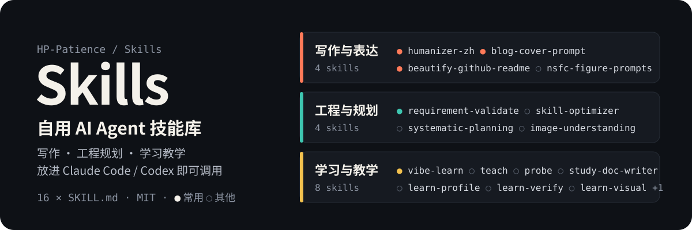

<p align="center">
  
</p>

<p align="center">
  <strong>16 个自用 AI Agent 技能，覆盖写作、工程规划和学习教学。</strong><br>
  每个技能是一个带 <code>SKILL.md</code> 的目录，复制到 Claude Code 或 Codex 的技能目录即可调用。
</p>

<p align="center">
  <a href="https://github.com/HP-Patience/Skills/stargazers"></a>
  <a href="https://github.com/HP-Patience/Skills/commits/main"></a>
  <a href="#全部技能"></a>
  <a href="#安装"></a>
  <a href="#许可"></a>
</p>

## 常用技能

我日常最常用的五个：

| 技能 | 什么时候用 |
|------|-----------|
| [humanizer-zh](skills/humanizer-zh/) | 中文稿子写完后，去掉 AI 腔和模板化句式 |
| [blog-cover-prompt](skills/blog-cover-prompt/) | 给 Firefly 博客文章写风格统一的封面绘图提示词 |
| [beautify-github-readme](skills/beautify-github-readme/) | 重新设计 GitHub README，或单独做头图、徽章等视觉素材 |
| [requirement-validate](skills/requirement-validate/) | 动手前先复述需求，确认理解一致再开工 |
| [vibe-learn](skills/vibe-learn/) | 非科班学开发：学工具怎么用、怎么向 AI 描述需求 |

## 全部技能

### 写作与表达

- **[humanizer-zh](skills/humanizer-zh/)** — 去除中文文本的 AI 写作痕迹，调整空泛表达、机械句式与模板化结构。
- **[blog-cover-prompt](skills/blog-cover-prompt/)** — 根据文章标题、摘要或正文，生成深蓝黑底、电蓝全息风格的博客封面提示词。
- **[beautify-github-readme](skills/beautify-github-readme/)** — 重构 README 的内容层级与视觉系统，或独立创建 SVG、PNG/WebP、GIF 素材。
- **[nsfc-figure-prompts](skills/nsfc-figure-prompts/)** — 为 NSFC 基金申请书生成架构图、技术路线图、机制示意图等科研绘图提示词。

### 工程与规划

- **[requirement-validate](skills/requirement-validate/)** — 需求理解确认闭环：复述需求，用户确认后结束，不直接进入实现。
- **[skill-optimizer](skills/skill-optimizer/)** — 用 7 层诊断框架分析并优化 Agent Skill 定义。
- **[systematic-planning](skills/systematic-planning/)** — 把学习、考试、项目或能力建设目标拆成可执行、可复盘的计划。
- **[image-understanding](skills/image-understanding/)** — 用本地 Qwen2-VL-2B-Instruct 分析图片，支持中文描述和图片问答。

### 学习与教学

- **[vibe-learn](skills/vibe-learn/)** — 为 Vibe Coding / 非科班开发者讲"怎么用"和"怎么向 AI 描述需求"。
- **[teach](skills/teach/)** — Alvar 方法的一对一自适应教学：探查理解边缘、规划依赖路径、逐步教学。
- **[probe](skills/probe/)** — 用分级测验探查学习者的知识状态，生成理解地图。
- **[learn-profile](skills/learn-profile/)** — 建立学习者档案，记录基础、目标、节奏和教学偏好。
- **[learn-visual](skills/learn-visual/)** — 为单个教学概念生成并检查可视化图示。
- **[learn-verify](skills/learn-verify/)** — 在教学前核查事实、定理、历史或工具/API 相关断言。
- **[study-doc-writer](skills/study-doc-writer/)** — 为理解型学习者写学习文档，强调因果链、推导、边界和练习。
- **[material-suitability-audit](skills/material-suitability-audit/)** — 从五个维度评估学习材料是否适合，再给出教学重构建议。

## 安装

克隆仓库，把需要的技能目录复制到 AI 助手的技能目录：

```bash
git clone https://github.com/HP-Patience/Skills.git
cd Skills

# Claude Code
cp -r skills/humanizer-zh ~/.claude/skills/

# Codex
cp -r skills/humanizer-zh ~/.codex/skills/
```

复制后重启会话，在对话里点名技能（如"用 humanizer-zh 改一下这段"）或直接描述需求即可触发。

<details>
<summary>目录结构</summary>

```
├── README.md
├── assets/hero.svg              # README 头图
└── skills/
    ├── humanizer-zh/            # 每个技能一个目录，核心是 SKILL.md
    ├── blog-cover-prompt/
    ├── ...
    └── vibe-learn/
```

</details>

## 第三方技能来源

- **humanizer-zh**：收录自 [op7418/Humanizer-zh](https://github.com/op7418/Humanizer-zh)，保留本地版本（上游提交 `91f3d394db8419c20d67ebe22a96cf8fee0a404b`），未升级到上游新版。核心内容翻译自 [blader/humanizer](https://github.com/blader/humanizer)，实用规则参考 [hardikpandya/stop-slop](https://github.com/hardikpandya/stop-slop)，基础指南为维基百科的 [AI 写作特征](https://en.wikipedia.org/wiki/Wikipedia:Signs_of_AI_writing)。原项目的 MIT 许可证与版权声明保留在 [skills/humanizer-zh/LICENSE](skills/humanizer-zh/LICENSE)。

## 许可

MIT